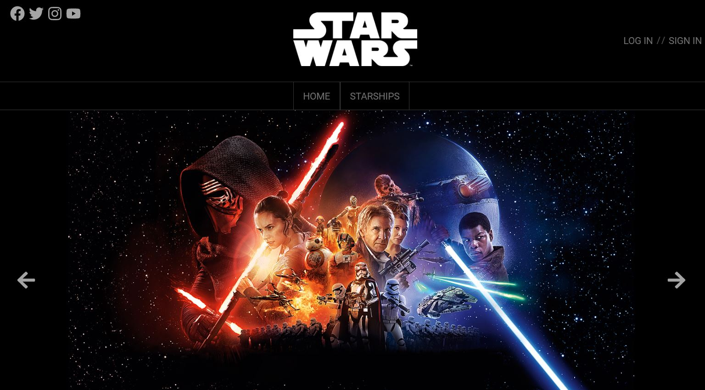
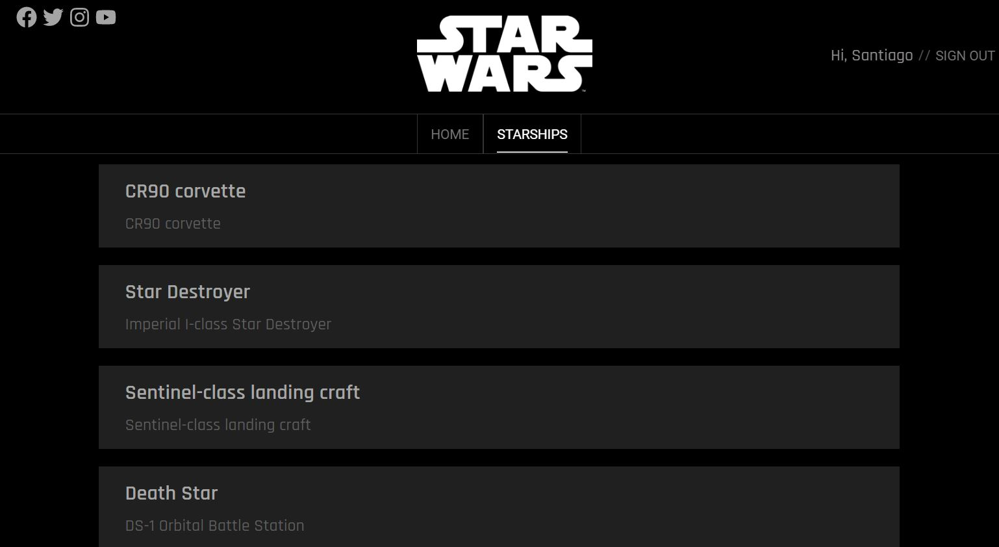
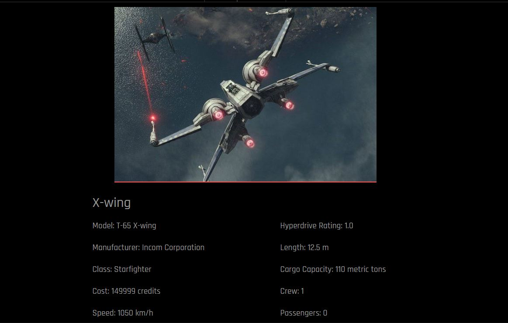

# S8. Star Wars - Starships viewer
## Description
This app was created as the 8th sprint of the IT Academy - Barcelona.

In this app you will be able to see all information about the Star Wars Starships.

[See deployed web here](https://BoccoSantiago.github.io/Sprint-8-Star-Wars/)

## Screen shots

## How to install
1. Clone this repository 
    > `git clone https://github.com/BoccoSantiago/Sprint-8-Star-Wars.git`
2. Access the app directory
    > `cd swapp`
4. Install all 
    >`npm install`
5. Run
    >`npm start`
## How to use
**IMPORTANT! To access some parts of the application you must first Sign Up then Log In with your created user.**
This app save your registration information at your own computer using [localStorage](https://developer.mozilla.org/es/docs/Web/API/Window/localStorage). **(Your information will not be saved at any database)**
